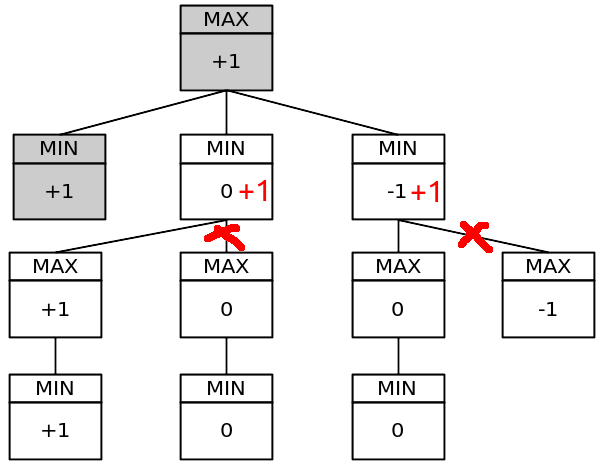

# 井字棋

## Minimax算法
如图所示，最佳移动位于中间，因为最大值位于左侧的第二个节点上。  

简化游戏树：  

## Alpha-Beta算法
Alpha-Beta剪枝优化，它允许我们忽略搜索树中的某些分支，因为他在搜索中剪切了不相关的节点（子树）。  

## 参考
1. https://github.com/Cledersonbc/tic-tac-toe-minimax
2. http://www.stratigery.com/ttt_ab.py
