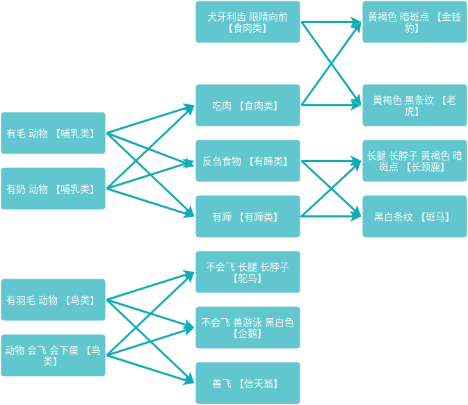

# 推理机
https://zh.wikipedia.org/wiki/推理机

## 正向推理机
https://en.wikipedia.org/wiki/Forward_chaining

## 反向推理机
https://en.wikipedia.org/wiki/Backward_chaining

## 数据集

1. 有毛的动物是哺乳类；
2. 有奶的动物是哺乳类；
3. 有羽毛的动物是鸟类；
4. 若动物会飞且会生蛋，则它是鸟类；
5. 吃肉的哺乳类是肉食动物；
6. 犬牙利爪，眼睛向前的是肉食动物；
7. 反刍食物的哺乳类是偶蹄类；
8. 有蹄的哺乳类是有蹄类；
9. 黄褐色有暗斑点的肉食类是金钱豹；
10. 黄褐色有黑条纹的肉食类是老虎；
11. 长腿长脖子有黄褐色暗斑的有蹄类是长颈鹿；
12. 有黑白条纹的有蹄类是斑马；
13. 不会飞长腿长脖子的鸟是鸵鸟；
14. 不会飞善游泳黑白色的鸟是企鹅；
15. 善飞的鸟是信天翁。

## 伪代码：课本上的说明，并不适用于Python
```
# 1. recall
# (recall fact)
# 判断变量fact中的一个事实是否在表facts中，若是，recall返回值是fact中的事实；否则，返回nil
def recall(fact):
    pass


# 2. test-if
# (test-if rule)
# 判断变量rule中的一条规则的前件包含的全部事实是否在表facts中，若是，test-if返回t；否则，返回nil
def test_if(rule):
    pass


# 3. remember
# (remember new)
# 判断变量new中的一个事实是否在表facts中，若是，remember返回nil；否则，将new中的事实添加到表facts的表头，
# 且remember返回new中的事实
def remember(new):
    pass


# 4. use-then
# (use-then rule)
# 判断变量rule中的一条规则的后件包含的全部结论是否在表facts中，若全部结论都在facts中，则use-then返回nil；
# 否则，将不在facts中的结论逐一添加到表facts中，且use-then返回t
def use_then(rule):
    pass


# 5. try-rule
# (try-raw rule)
# 判断规则变量rule中的一条规则的前件包含的全部事实是否在表facts中，若全部事实都在facts中，且规则后件有不在facts中的结论，
# 则把不在facts中的结论逐一添加到表facts中，try-rule返回t；否则，try-rule返回nil
def try_rule(rule):
    pass


# 6. step-forward
# (step-forward rules)
# 逐次扫描规则库rules中的规则，若发现rules中有一条可用规则，即该规则的前件包含的全部事实在表facts中，
# 则把该规则的后件中不在facts中的所有结论添加到facts中，且step-forward返回t；
# 若rules中没有一条可用规则，则step-forward返回nil
def step_forward(rules):
    pass


# 7. deduce
# (deduce facts)
# 连续不断地从规则库rules中选择可用规则，每选择到一条可用规则，则把该规则的后件中不在facts中的所有结论添加到facts中，
# 对facts扩充，由扩充了的facts来选择下一条可用规则对facts再次扩充，直至没有可用规则可选为止。
# 若曾找到一条可用规则对facts进行过一次扩充，则deduce返回t；否则，deduce返回nil
def deduce(facts):
    pass
```
