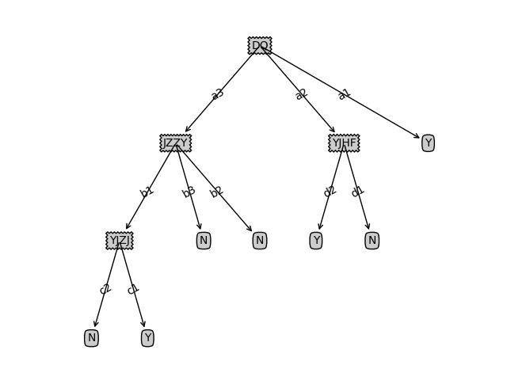

# 决策树

## 第一题

#### 数据集
{DQ, JZZY, YJZJ, YJHF}
1. 所在地区(DQ) Value(DQ) = {a1, a2, a3}
2. 机主职业(JZZY) Value(JZZY) = {b1, b2, b3}
3. 月均主叫次数范围(YJZJ) Value(YJZJ) = {c1, c2, c3}
4. 月均话费范围(YJHF) Value(YJHF) = {d1, d2}
5. 分类结果(Class) Value(Class) = {能发展, 不能发展} => {Y, N}

#### ID3树
```
{'DQ': {'a2': {'YJHF': {'d1': 'N', 'd2': 'Y'}}, 'a3': {'JZZY': {'b1': {'YJZJ': {'c2': 'N', 'c1': 'Y'}}, 'b2': 'N', 'b3': 'N'}}, 'a1': 'Y'}}
```

#### 可视化结果



## 第二题

#### 数据集
{Education, Sex, Language, Character, Job}
1. 学历(Education) Value(Education) = {研究生, 本科, 专科} => {postgraduate, undergraduate, college}
2. 性别(Sex) Value(Sex) = {男, 女} => {man, woman}
3. 外语水平(Language) Value(Language) = {4级以下, 4级, 6级} => {no, cet4, cet6}
4. 性格特征(Character) Value(Character) = {a1, a2, a3}
5. 岗位性质(Job) Value(Job) = {b1, b2, b3}
6. 分类结果(Class) Value(Class) = {称职, 基本称职或不称职} => {Y, N}

#### ID3树
```
{'Job': {'b3': {'Character': {'a2': 'N', 'a3': 'Y', 'a1': {'Education': {'postgraduate': 'N', 'undergraduate': 'Y'}}}}, 'b1': {'Language': {'cet4': 'Y', 'no': 'N', 'cet6': {'Education': {'postgraduate': 'Y', 'undergraduate': 'N'}}}}, 'b2': 'Y'}}
```

#### 可视化结果

